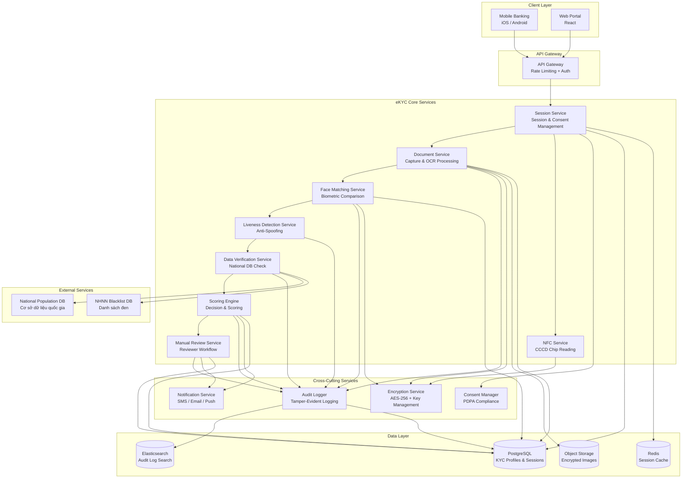
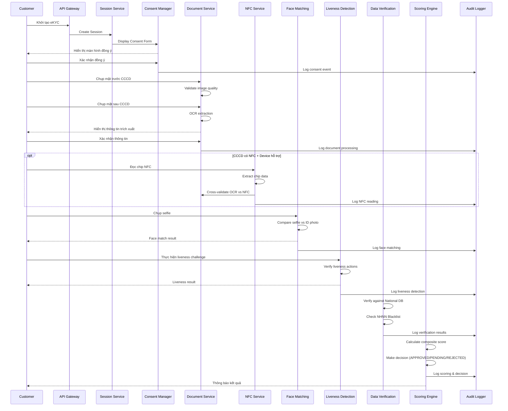
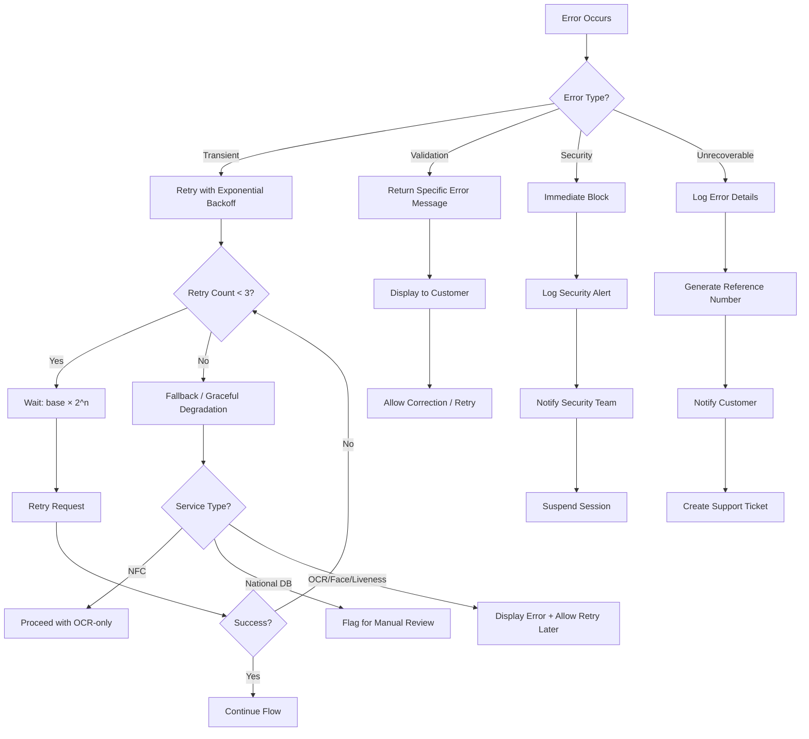

# Design Document — eKYC (Electronic Know Your Customer)

## Overview

Hệ thống eKYC cung cấp quy trình xác minh danh tính điện tử cho khách hàng cá nhân, cho phép mở tài khoản và nâng cấp dịch vụ ngân hàng từ xa mà không cần đến quầy giao dịch. Hệ thống tích hợp nhiều công nghệ xác minh: OCR giấy tờ tùy thân, đọc chip NFC trên CCCD, nhận diện khuôn mặt (face matching), phát hiện người thật (liveness detection), và xác minh qua cơ sở dữ liệu quốc gia.

### Mục tiêu thiết kế

- Xác minh danh tính khách hàng với độ chính xác cao, tuân thủ Thông tư 09/2020/TT-NHNN và Thông tư 16/2020/TT-NHNN
- Bảo vệ dữ liệu cá nhân và sinh trắc học theo Nghị định 13/2023/NĐ-CP
- Hỗ trợ đa kênh: Mobile Banking (iOS, Android) và Web Portal
- Tự động hóa quyết định KYC với cơ chế escalation cho trường hợp rủi ro cao
- Đảm bảo audit trail đầy đủ cho kiểm toán nội bộ và NHNN

### Phạm vi

Hệ thống bao gồm:
1. Module quản lý consent và khởi tạo session
2. Module chụp và xử lý giấy tờ tùy thân (OCR)
3. Module đọc chip NFC trên CCCD
4. Module xác minh khuôn mặt (Face Matching)
5. Module phát hiện người thật (Liveness Detection)
6. Module xác minh qua cơ sở dữ liệu quốc gia
7. Engine tính điểm và quyết định KYC
8. Module xem xét thủ công (Manual Review)
9. Module bảo vệ dữ liệu cá nhân và mã hóa
10. Module ghi nhận kiểm toán (Audit Trail)

## Architecture

### Kiến trúc tổng quan

Hệ thống eKYC được thiết kế theo kiến trúc microservices, tách biệt các module xử lý để đảm bảo khả năng mở rộng và bảo trì độc lập.



### Luồng xử lý chính (Happy Path)




### Quyết định kiến trúc

| Quyết định | Lựa chọn | Lý do |
|---|---|---|
| Kiến trúc tổng thể | Microservices | Cho phép scale độc lập từng module (OCR, Face Matching có tải khác nhau); dễ thay thế vendor AI/ML |
| Giao tiếp giữa services | REST (sync) + Message Queue (async) | REST cho luồng chính cần response ngay; Message Queue cho audit logging, notification |
| Session management | Redis + JWT | Redis cho session state với TTL 30 phút; JWT cho stateless auth giữa services |
| Image storage | Object Storage (S3-compatible) + AES-256 | Lưu trữ ảnh giấy tờ và selfie với mã hóa at-rest; tách biệt khỏi DB chính |
| Audit log storage | PostgreSQL + Elasticsearch | PostgreSQL cho immutable log records; Elasticsearch cho search/export |
| Encryption key management | HSM/KMS | Tuân thủ Thông tư 09/2020 về quản lý khóa mã hóa |
| Data residency | On-premise hoặc Vietnam-region cloud | Dữ liệu khách hàng phải lưu trữ tại Việt Nam |

## Components and Interfaces

### 1. Session Service

Quản lý vòng đời session eKYC, bao gồm khởi tạo, theo dõi tiến trình, và hết hạn.

```typescript
interface SessionService {
  // Khởi tạo session eKYC mới
  createSession(request: CreateSessionRequest): Promise<EKYCSession>;
  
  // Lấy thông tin session hiện tại
  getSession(sessionId: string): Promise<EKYCSession>;
  
  // Cập nhật tiến trình session (step completed)
  updateProgress(sessionId: string, step: EKYCStep, result: StepResult): Promise<void>;
  
  // Resume session sau khi mất kết nối
  resumeSession(sessionId: string): Promise<EKYCSession>;
  
  // Hủy session
  cancelSession(sessionId: string, reason: string): Promise<void>;
}

interface CreateSessionRequest {
  customerId: string;
  channel: 'MOBILE_IOS' | 'MOBILE_ANDROID' | 'WEB_PORTAL';
  deviceInfo: DeviceInfo;
  ipAddress: string;
}

interface EKYCSession {
  sessionId: string;           // UUID, unique per session
  customerId: string;
  channel: string;
  status: 'ACTIVE' | 'COMPLETED' | 'EXPIRED' | 'CANCELLED';
  currentStep: EKYCStep;
  completedSteps: EKYCStep[];
  consentRecorded: boolean;
  createdAt: Date;             // UTC+7
  expiresAt: Date;             // createdAt + 30 minutes
  deviceInfo: DeviceInfo;
  ipAddress: string;
}

type EKYCStep = 
  | 'CONSENT'
  | 'DOCUMENT_CAPTURE_FRONT'
  | 'DOCUMENT_CAPTURE_BACK'
  | 'OCR_PROCESSING'
  | 'NFC_READING'
  | 'FACE_MATCHING'
  | 'LIVENESS_DETECTION'
  | 'DATA_VERIFICATION'
  | 'SCORING'
  | 'DECISION';
```

### 2. Consent Manager

Quản lý sự đồng ý của khách hàng theo Nghị định 13/2023/NĐ-CP.

```typescript
interface ConsentManager {
  // Hiển thị và ghi nhận consent
  recordConsent(request: ConsentRequest): Promise<ConsentRecord>;
  
  // Kiểm tra consent còn hiệu lực
  validateConsent(sessionId: string, dataCategory: DataCategory): Promise<boolean>;
  
  // Rút lại consent
  revokeConsent(customerId: string, consentId: string): Promise<void>;
  
  // Lấy lịch sử consent
  getConsentHistory(customerId: string): Promise<ConsentRecord[]>;
}

interface ConsentRequest {
  sessionId: string;
  customerId: string;
  dataCategories: DataCategory[];  // Loại dữ liệu được đồng ý thu thập
  consentVersion: string;          // Version của nội dung consent
  ipAddress: string;
  timestamp: Date;
}

type DataCategory = 
  | 'IDENTITY_INFO'       // Họ tên, ngày sinh, giới tính, địa chỉ
  | 'BIOMETRIC_FACIAL'    // Ảnh khuôn mặt
  | 'ID_DOCUMENT_IMAGE'   // Ảnh giấy tờ tùy thân
  | 'NFC_CHIP_DATA';      // Dữ liệu chip NFC (bao gồm vân tay)

interface ConsentRecord {
  consentId: string;
  sessionId: string;
  customerId: string;
  dataCategories: DataCategory[];
  consentVersion: string;
  grantedAt: Date;
  revokedAt?: Date;
  ipAddress: string;
}
```

### 3. Document Service

Xử lý chụp ảnh giấy tờ, validate chất lượng, và trích xuất thông tin qua OCR.

```typescript
interface DocumentService {
  // Validate chất lượng ảnh chụp
  validateImageQuality(image: ImageData): Promise<ImageQualityResult>;
  
  // Trích xuất thông tin từ ảnh giấy tờ qua OCR
  extractDocumentData(request: OCRRequest): Promise<OCRResult>;
  
  // Khách hàng xác nhận/sửa thông tin OCR
  confirmExtractedData(sessionId: string, confirmedData: DocumentData): Promise<void>;
  
  // Cross-validate OCR data với NFC data
  crossValidate(ocrData: DocumentData, nfcData: DocumentData): Promise<CrossValidationResult>;
}

interface ImageQualityResult {
  isValid: boolean;
  resolution: { width: number; height: number };
  issues: ImageQualityIssue[];  // 'BLUR' | 'LOW_LIGHT' | 'INCOMPLETE' | 'GLARE'
}

type ImageQualityIssue = 'BLUR' | 'LOW_LIGHT' | 'INCOMPLETE_DOCUMENT' | 'GLARE';

interface OCRRequest {
  sessionId: string;
  documentType: 'CCCD' | 'CMND' | 'PASSPORT';
  frontImage: ImageData;
  backImage: ImageData;
}

interface OCRResult {
  confidence: number;          // 0-100, minimum 95% for CCCD
  extractedData: DocumentData;
  rawOCROutput: string;        // For audit purposes
}

interface DocumentData {
  fullName: string;
  dateOfBirth: Date;
  gender: 'MALE' | 'FEMALE';
  idNumber: string;
  issueDate: Date;
  expiryDate?: Date;           // CMND may not have expiry
  placeOfOrigin: string;
  permanentAddress: string;
  documentType: 'CCCD' | 'CMND' | 'PASSPORT';
  portraitPhoto?: ImageData;   // From NFC chip
}
```

### 4. NFC Service

Đọc dữ liệu chip NFC trên CCCD gắn chip.

```typescript
interface NFCService {
  // Đọc dữ liệu từ chip NFC
  readChipData(request: NFCReadRequest): Promise<NFCReadResult>;
}

interface NFCReadRequest {
  sessionId: string;
  attemptNumber: number;       // 1-3, max 3 attempts
  timeout: number;             // 15 seconds per attempt
}

interface NFCReadResult {
  success: boolean;
  data?: NFCChipData;
  failureReason?: 'TIMEOUT' | 'CHIP_ERROR' | 'DEVICE_NOT_SUPPORTED' | 'AUTHENTICATION_FAILED';
  attemptNumber: number;
  durationMs: number;
}

interface NFCChipData {
  fullName: string;
  dateOfBirth: Date;
  gender: 'MALE' | 'FEMALE';
  idNumber: string;
  portraitPhoto: ImageData;
  fingerprintTemplate: EncryptedData;  // Always encrypted
  digitalSignature: string;
}
```

### 5. Face Matching Service

So khớp khuôn mặt giữa selfie và ảnh trên giấy tờ.

```typescript
interface FaceMatchingService {
  // So khớp khuôn mặt
  compareFaces(request: FaceCompareRequest): Promise<FaceCompareResult>;
  
  // Validate selfie image
  validateSelfie(image: ImageData): Promise<SelfieValidationResult>;
}

interface FaceCompareRequest {
  sessionId: string;
  selfieImage: ImageData;
  referenceImage: ImageData;   // From ID document or NFC chip
  attemptNumber: number;       // 1-3, max 3 retries
}

interface FaceCompareResult {
  score: number;               // 0-100 (Verification_Score)
  passed: boolean;             // score >= 80
  attemptNumber: number;
  processingTimeMs: number;    // Must be < 3000ms
}

interface SelfieValidationResult {
  isValid: boolean;
  issues: SelfieIssue[];
}

type SelfieIssue = 'MULTIPLE_FACES' | 'FACE_OBSCURED' | 'SUNGLASSES' | 'LOW_QUALITY';
```

### 6. Liveness Detection Service

Phát hiện người thật, chống giả mạo.

```typescript
interface LivenessDetectionService {
  // Tạo liveness challenge
  createChallenge(sessionId: string): Promise<LivenessChallenge>;
  
  // Xác minh kết quả liveness
  verifyLiveness(request: LivenessVerifyRequest): Promise<LivenessResult>;
}

interface LivenessChallenge {
  challengeId: string;
  actions: LivenessAction[];   // Exactly 2 random actions
  maxDurationSeconds: 30;
  createdAt: Date;
}

type LivenessAction = 'BLINK' | 'TURN_LEFT' | 'TURN_RIGHT' | 'SMILE' | 'NOD';

interface LivenessVerifyRequest {
  sessionId: string;
  challengeId: string;
  videoFrames: ImageData[];
  attemptNumber: number;       // 1-3, max 3 retries
}

interface LivenessResult {
  passed: boolean;
  actionsCompleted: LivenessAction[];
  spoofDetected: boolean;
  spoofType?: 'PRINTED_PHOTO' | 'SCREEN_REPLAY' | 'VIDEO_REPLAY' | '3D_MASK';
  confidence: number;          // 0-100, detection accuracy >= 99%
  processingTimeMs: number;    // Must be < 2000ms
  attemptNumber: number;
}
```

### 7. Data Verification Service

Xác minh thông tin qua cơ sở dữ liệu quốc gia và danh sách đen NHNN.

```typescript
interface DataVerificationService {
  // Xác minh qua CSDL quốc gia về dân cư
  verifyAgainstNationalDB(request: NationalDBRequest): Promise<NationalDBResult>;
  
  // Kiểm tra danh sách đen NHNN
  checkBlacklist(idNumber: string): Promise<BlacklistResult>;
}

interface NationalDBRequest {
  sessionId: string;
  idNumber: string;
  fullName: string;
  dateOfBirth: Date;
  gender: 'MALE' | 'FEMALE';
}

interface NationalDBResult {
  matched: boolean;
  verifiedAt: Date;
  mismatchedFields?: string[];  // Fields that don't match
  unavailable?: boolean;        // Service unavailable
}

interface BlacklistResult {
  isBlacklisted: boolean;
  reason?: string;
  checkedAt: Date;
}
```

### 8. Scoring Engine

Tính điểm tổng hợp và đưa ra quyết định KYC.

```typescript
interface ScoringEngine {
  // Tính điểm tổng hợp và quyết định
  calculateScore(request: ScoreRequest): Promise<ScoreResult>;
}

interface ScoreRequest {
  sessionId: string;
  ocrConfidence: number;           // Weight: 20%
  nfcVerified: boolean | null;     // Weight: 15% (null if NFC not available)
  faceMatchScore: number;          // Weight: 30%
  livenessResult: boolean;         // Weight: 20%
  nationalDBVerified: boolean;     // Weight: 15%
}

interface ScoreResult {
  compositeScore: number;          // 0-100
  decision: 'APPROVED' | 'PENDING_REVIEW' | 'REJECTED';
  // APPROVED: score >= 85
  // PENDING_REVIEW: 60 <= score < 85
  // REJECTED: score < 60
  scoreBreakdown: {
    ocrComponent: number;
    nfcComponent: number;
    faceMatchComponent: number;
    livenessComponent: number;
    nationalDBComponent: number;
  };
  decidedAt: Date;
  processingTimeMs: number;        // Must be < 5000ms
}
```

### 9. Manual Review Service

Quản lý quy trình xem xét thủ công cho hồ sơ cần review.

```typescript
interface ManualReviewService {
  // Lấy danh sách hồ sơ cần review
  getPendingReviews(reviewerId: string): Promise<ReviewItem[]>;
  
  // Lấy chi tiết hồ sơ review
  getReviewDetail(profileId: string): Promise<ReviewDetail>;
  
  // Phê duyệt hồ sơ
  approveProfile(profileId: string, reviewerId: string): Promise<void>;
  
  // Từ chối hồ sơ
  rejectProfile(profileId: string, reviewerId: string, reason: string): Promise<void>;
  
  // Yêu cầu bổ sung thông tin
  requestAdditionalInfo(profileId: string, reviewerId: string, instructions: string): Promise<void>;
  
  // Escalate hồ sơ quá hạn
  escalateOverdue(): Promise<EscalationResult>;
}

interface ReviewDetail {
  profileId: string;
  customerSelfie: EncryptedImageRef;
  idDocumentFront: EncryptedImageRef;
  idDocumentBack: EncryptedImageRef;
  ocrData: DocumentData;
  nfcData?: NFCChipData;
  faceMatchScore: number;
  livenessResult: boolean;
  nationalDBResult: NationalDBResult;
  compositeScore: number;
  assignedAt: Date;
  deadline: Date;               // assignedAt + 24 hours
}
```

### 10. Audit Logger

Ghi nhận toàn bộ hành động trong quy trình eKYC.

```typescript
interface AuditLogger {
  // Ghi log sự kiện
  logEvent(event: AuditEvent): Promise<void>;
  
  // Tìm kiếm audit log
  searchLogs(query: AuditSearchQuery): Promise<AuditSearchResult>;
  
  // Export audit log
  exportLogs(query: AuditSearchQuery, format: 'CSV' | 'JSON'): Promise<ExportResult>;
  
  // Verify log integrity
  verifyIntegrity(fromDate: Date, toDate: Date): Promise<IntegrityCheckResult>;
}

interface AuditEvent {
  eventId: string;              // UUID
  eventType: AuditEventType;
  sessionId: string;
  actor: { type: 'CUSTOMER' | 'REVIEWER' | 'SYSTEM'; id: string };
  timestamp: Date;              // UTC+7
  ipAddress: string;
  deviceInfo?: DeviceInfo;
  resultStatus: 'SUCCESS' | 'FAILURE' | 'ERROR';
  details: Record<string, unknown>;
  previousHash: string;         // Hash of previous log entry (tamper-evident chain)
  currentHash: string;          // SHA-256 hash of this entry
}

type AuditEventType =
  | 'SESSION_INITIATED'
  | 'CONSENT_RECORDED'
  | 'CONSENT_REVOKED'
  | 'DOCUMENT_CAPTURED'
  | 'OCR_PROCESSED'
  | 'NFC_READ'
  | 'FACE_MATCHED'
  | 'LIVENESS_VERIFIED'
  | 'NATIONAL_DB_VERIFIED'
  | 'BLACKLIST_CHECKED'
  | 'SCORE_CALCULATED'
  | 'DECISION_MADE'
  | 'REVIEW_ASSIGNED'
  | 'REVIEW_APPROVED'
  | 'REVIEW_REJECTED'
  | 'ADDITIONAL_INFO_REQUESTED'
  | 'BIOMETRIC_DATA_ACCESSED'
  | 'DATA_DELETION_REQUESTED'
  | 'SESSION_EXPIRED'
  | 'SESSION_RESUMED'
  | 'ERROR_OCCURRED';
```


## Data Models

### KYC Profile

```mermaid
erDiagram
    KYC_PROFILE {
        uuid profile_id PK
        uuid customer_id FK
        string status "APPROVED | PENDING_REVIEW | REJECTED | IN_PROGRESS"
        float composite_score "0-100"
        string decision_type "AUTO | MANUAL"
        timestamp created_at "UTC+7"
        timestamp updated_at
        timestamp decided_at
        string channel "MOBILE_IOS | MOBILE_ANDROID | WEB_PORTAL"
    }

    EKYC_SESSION {
        uuid session_id PK
        uuid profile_id FK
        uuid customer_id FK
        string status "ACTIVE | COMPLETED | EXPIRED | CANCELLED"
        string current_step
        jsonb completed_steps
        boolean consent_recorded
        string channel
        string ip_address
        jsonb device_info
        timestamp created_at
        timestamp expires_at "created_at + 30min"
    }

    CONSENT_RECORD {
        uuid consent_id PK
        uuid session_id FK
        uuid customer_id FK
        string consent_version
        jsonb data_categories
        string ip_address
        timestamp granted_at
        timestamp revoked_at "nullable"
    }

    DOCUMENT_RECORD {
        uuid document_id PK
        uuid profile_id FK
        string document_type "CCCD | CMND | PASSPORT"
        string front_image_ref "encrypted S3 reference"
        string back_image_ref "encrypted S3 reference"
        jsonb ocr_data "encrypted JSON"
        float ocr_confidence "0-100"
        boolean nfc_available
        jsonb nfc_data "encrypted JSON, nullable"
        jsonb cross_validation_result "nullable"
        timestamp processed_at
    }

    FACE_MATCH_RECORD {
        uuid match_id PK
        uuid profile_id FK
        string selfie_image_ref "encrypted S3 reference"
        float score "0-100"
        boolean passed "score >= 80"
        int attempt_number "1-3"
        int processing_time_ms
        timestamp matched_at
    }

    LIVENESS_RECORD {
        uuid liveness_id PK
        uuid profile_id FK
        jsonb challenge_actions "2 random actions"
        boolean passed
        boolean spoof_detected
        string spoof_type "nullable"
        float confidence "0-100"
        int attempt_number "1-3"
        int processing_time_ms
        timestamp verified_at
    }

    VERIFICATION_RECORD {
        uuid verification_id PK
        uuid profile_id FK
        boolean national_db_matched
        jsonb mismatched_fields "nullable"
        boolean blacklisted
        string blacklist_reason "nullable"
        timestamp verified_at
    }

    SCORE_RECORD {
        uuid score_id PK
        uuid profile_id FK
        float composite_score "0-100"
        jsonb score_breakdown
        string decision "APPROVED | PENDING_REVIEW | REJECTED"
        int processing_time_ms
        timestamp calculated_at
    }

    REVIEW_RECORD {
        uuid review_id PK
        uuid profile_id FK
        uuid reviewer_id FK
        string action "APPROVED | REJECTED | ADDITIONAL_INFO"
        string rejection_reason "nullable"
        string additional_info_instructions "nullable"
        timestamp assigned_at
        timestamp deadline "assigned_at + 24h"
        timestamp completed_at "nullable"
        boolean escalated
    }

    AUDIT_LOG {
        uuid event_id PK
        string event_type
        uuid session_id FK
        string actor_type "CUSTOMER | REVIEWER | SYSTEM"
        string actor_id
        timestamp event_timestamp "UTC+7"
        string ip_address
        jsonb device_info "nullable"
        string result_status "SUCCESS | FAILURE | ERROR"
        jsonb details
        string previous_hash
        string current_hash "SHA-256"
    }

    KYC_PROFILE ||--o{ EKYC_SESSION : "has sessions"
    KYC_PROFILE ||--|| DOCUMENT_RECORD : "has document"
    KYC_PROFILE ||--o{ FACE_MATCH_RECORD : "has face matches"
    KYC_PROFILE ||--o{ LIVENESS_RECORD : "has liveness checks"
    KYC_PROFILE ||--|| VERIFICATION_RECORD : "has verification"
    KYC_PROFILE ||--|| SCORE_RECORD : "has score"
    KYC_PROFILE ||--o{ REVIEW_RECORD : "has reviews"
    EKYC_SESSION ||--|| CONSENT_RECORD : "has consent"
    EKYC_SESSION ||--o{ AUDIT_LOG : "has audit logs"
```



### Quy tắc dữ liệu

| Quy tắc | Mô tả |
|---|---|
| Mã hóa at-rest | Tất cả biometric data (ảnh khuôn mặt, vân tay) và ảnh giấy tờ được mã hóa AES-256 |
| Mã hóa in-transit | TLS 1.2+ cho mọi giao tiếp |
| Data retention | KYC Profile: tối thiểu 10 năm từ ngày đóng tài khoản |
| Biometric deletion | Xóa trong 30 ngày khi khách hàng yêu cầu (trừ dữ liệu bắt buộc lưu trữ theo luật) |
| Audit log integrity | Hash chain (SHA-256) cho tamper-evident logging |
| Audit log retention | Tối thiểu 10 năm |
| Access control | RBAC — chỉ Reviewer và Compliance Officer được truy cập biometric data |
| Image storage | Ảnh lưu trên Object Storage riêng biệt, reference qua encrypted pointer trong DB |
| Session data | Redis TTL 30 phút, tự động xóa khi hết hạn |
| Sensitive fields | Encrypted JSON columns cho OCR data, NFC data trong PostgreSQL |


## Correctness Properties

*A property is a characteristic or behavior that should hold true across all valid executions of a system — essentially, a formal statement about what the system should do. Properties serve as the bridge between human-readable specifications and machine-verifiable correctness guarantees.*

### Property 1: Consent recording completeness

*For any* valid consent request containing a customerId, sessionId, consent version, and IP address, the resulting ConsentRecord SHALL contain all four fields with non-null values and a timestamp within 1 second of the request time.

**Validates: Requirements 1.2**

### Property 2: Session creation invariants

*For any* two eKYC session creation requests, the generated session IDs SHALL be unique (no collisions), and for any created session, the expiresAt timestamp SHALL equal createdAt + exactly 30 minutes.

**Validates: Requirements 1.5**

### Property 3: Image quality validation

*For any* image metadata (resolution, blur score, lighting score, document completeness), the image quality validator SHALL accept the image if and only if resolution >= 1280x720, blur is below threshold, lighting is adequate, and document is fully visible. This applies identically to both front and back document images.

**Validates: Requirements 2.2, 2.3**

### Property 4: Quality issue to error message mapping

*For any* image that fails quality validation, the returned error message SHALL specifically identify the quality issue type (BLUR, LOW_LIGHT, INCOMPLETE_DOCUMENT, or GLARE), and each distinct issue type SHALL map to a distinct, non-empty error message.

**Validates: Requirements 2.4**

### Property 5: OCR extraction completeness

*For any* valid document image pair (front + back) that passes quality validation, the OCR result SHALL contain all required fields: fullName, dateOfBirth, gender, idNumber, issueDate, expiryDate (for CCCD), placeOfOrigin, and permanentAddress — all non-empty.

**Validates: Requirements 2.5**

### Property 6: NFC trigger condition

*For any* combination of (deviceSupportsNFC: boolean, documentType: string), the NFC reading SHALL be attempted if and only if deviceSupportsNFC is true AND documentType is 'CCCD'.

**Validates: Requirements 3.1**

### Property 7: NFC extraction completeness

*For any* successful NFC chip read, the result SHALL contain all required fields: fullName, dateOfBirth, gender, idNumber, portraitPhoto, fingerprintTemplate, and digitalSignature — all non-null.

**Validates: Requirements 3.2**

### Property 8: OCR vs NFC cross-validation

*For any* pair of OCR-extracted data and NFC chip data, the cross-validation function SHALL identify every field where the two data sources differ, and the set of flagged discrepancies SHALL be exactly the set of fields with non-matching values.

**Validates: Requirements 3.3**

### Property 9: Face match threshold and attempt tracking

*For any* face comparison result with a score in [0, 100], the passed flag SHALL be true if and only if score >= 80. Additionally, for any sequence of face match attempts on the same session, the attempt number SHALL increment correctly from 1 to a maximum of 3.

**Validates: Requirements 4.3, 4.4, 4.5**

### Property 10: Selfie validation rejection

*For any* selfie image containing multiple faces, an obscured face, or sunglasses, the selfie validator SHALL reject the image and return the specific issue type that caused rejection.

**Validates: Requirements 4.7**

### Property 11: Liveness challenge generation invariant

*For any* liveness challenge creation, the generated challenge SHALL contain exactly 2 actions, and each action SHALL be a member of the valid set {BLINK, TURN_LEFT, TURN_RIGHT, SMILE, NOD}.

**Validates: Requirements 5.1**

### Property 12: Liveness completion implies PASSED

*For any* liveness verification where all required challenge actions are successfully completed within the time limit, the liveness result SHALL be marked as PASSED.

**Validates: Requirements 5.3**

### Property 13: Composite score weighted calculation

*For any* set of component scores (ocrConfidence, nfcVerified, faceMatchScore, livenessResult, nationalDBVerified), the composite Verification_Score SHALL equal: ocrConfidence × 0.20 + nfcScore × 0.15 + faceMatchScore × 0.30 + livenessScore × 0.20 + nationalDBScore × 0.15, where boolean results are converted to 0 or 100.

**Validates: Requirements 7.1**

### Property 14: Score-to-decision threshold mapping

*For any* composite Verification_Score in [0, 100], the decision SHALL be: APPROVED if score >= 85, PENDING_REVIEW if 60 <= score < 85, and REJECTED if score < 60. These three ranges SHALL be exhaustive and mutually exclusive.

**Validates: Requirements 7.2, 7.3, 7.4**

### Property 15: Review detail completeness

*For any* KYC_Profile assigned for manual review, the ReviewDetail SHALL contain all required fields: customerSelfie, idDocumentFront, idDocumentBack, ocrData, faceMatchScore, livenessResult, nationalDBResult, and compositeScore — all non-null.

**Validates: Requirements 8.1**

### Property 16: Rejection requires non-empty reason

*For any* reviewer rejection action, the rejection reason string SHALL be non-empty and non-whitespace. The system SHALL reject any rejection attempt with an empty or whitespace-only reason.

**Validates: Requirements 8.4**

### Property 17: Review deadline and overdue detection

*For any* review assignment, the deadline SHALL equal assignedAt + exactly 24 hours. For any set of review records, the overdue detection function SHALL flag exactly those records where the current time exceeds the deadline and the review is not yet completed.

**Validates: Requirements 8.6**

### Property 18: Consent precondition enforcement

*For any* data collection operation targeting a specific DataCategory, the operation SHALL succeed only if a valid (non-revoked) consent record exists for that customer and that specific data category. Operations without matching consent SHALL be blocked.

**Validates: Requirements 9.2**

### Property 19: RBAC for biometric data access

*For any* biometric data access attempt with a given user role, the access SHALL be granted if and only if the role is REVIEWER or COMPLIANCE_OFFICER. All other roles SHALL be denied access.

**Validates: Requirements 9.5**

### Property 20: Audit event completeness and logging

*For any* eKYC step completion or biometric data access event, the system SHALL produce an audit log entry containing all required metadata: eventTimestamp (UTC+7), eventType, actor (type + id), sessionId, ipAddress, deviceInfo, and resultStatus — all non-null.

**Validates: Requirements 9.6, 10.1, 10.2**

### Property 21: Audit log hash chain integrity

*For any* sequence of N audit log entries, each entry's previousHash SHALL equal the preceding entry's currentHash, and each entry's currentHash SHALL equal SHA-256(entry content). The first entry's previousHash SHALL be a known genesis hash.

**Validates: Requirements 10.4**

### Property 22: Session resume preserves progress

*For any* active session with a set of completed steps, resuming the session SHALL restore the session to the exact same set of completed steps and position the current step at the next uncompleted step in the workflow.

**Validates: Requirements 11.1**

### Property 23: Retry with exponential backoff

*For any* external service call that fails, the retry mechanism SHALL attempt up to 3 retries with exponentially increasing delays (e.g., delay_n = base_delay × 2^n). After 3 failed retries, the system SHALL return a user-friendly error.

**Validates: Requirements 11.2**

### Property 24: Unrecoverable error handling workflow

*For any* unrecoverable error event, the system SHALL perform exactly 3 actions: (1) log the error details in the audit trail, (2) notify the customer with a unique reference number, and (3) create a support ticket. The reference number in the notification SHALL match the reference in the support ticket.

**Validates: Requirements 11.4**


## Error Handling

### Chiến lược xử lý lỗi theo tầng



### Phân loại lỗi và xử lý

| Loại lỗi | Ví dụ | Xử lý | Retry |
|---|---|---|---|
| Validation Error | Ảnh mờ, selfie có nhiều khuôn mặt | Trả về lỗi cụ thể, cho phép chụp lại | Không giới hạn (trong session) |
| Transient Error | Network timeout, service 503 | Retry exponential backoff | Tối đa 3 lần |
| NFC Failure | Chip không đọc được, device không hỗ trợ | Fallback sang OCR-only | Tối đa 3 lần NFC, sau đó fallback |
| Biometric Failure | Face match < 80, liveness fail | Cho phép retry, sau 3 lần → manual review | Tối đa 3 lần |
| Security Alert | ID trên blacklist, spoof detected | Block ngay, log alert, notify security | Không retry |
| External Service Down | National DB unavailable | Flag manual review, notify reviewer | Tối đa 3 lần trước khi flag |
| Session Expired | Quá 30 phút | Notify customer, cho phép tạo session mới, giữ documents 24h | Tạo session mới |
| Unrecoverable Error | Internal server error, data corruption | Log, notify customer với reference number, tạo support ticket | Không retry |

### Session Recovery

```typescript
interface SessionRecovery {
  // Khi mất kết nối
  onDisconnect(sessionId: string): void;
  // - Lưu current state vào Redis
  // - Giữ session active cho đến khi hết hạn (30 phút)
  
  // Khi reconnect
  onReconnect(sessionId: string): EKYCSession | null;
  // - Kiểm tra session còn valid (chưa hết hạn)
  // - Restore state từ Redis
  // - Trả về session với completedSteps và currentStep
  // - Nếu session hết hạn → return null, yêu cầu tạo mới
  
  // Khi session hết hạn
  onSessionExpired(sessionId: string): void;
  // - Notify customer
  // - Giữ uploaded documents trong S3 thêm 24 giờ
  // - Mark session as EXPIRED
  // - Log audit event
}
```

## Testing Strategy

### Dual Testing Approach

Hệ thống eKYC sử dụng kết hợp unit tests (example-based) và property-based tests để đảm bảo coverage toàn diện.

### Property-Based Testing

**Library**: fast-check (TypeScript/JavaScript) hoặc Hypothesis (Python) tùy theo ngôn ngữ implementation.

**Cấu hình**:
- Minimum 100 iterations per property test
- Mỗi property test phải reference property number trong design document
- Tag format: `Feature: ekyc-banking, Property {number}: {property_text}`

**Properties cần implement** (24 properties từ Correctness Properties section):

| Property | Module | Mô tả ngắn |
|---|---|---|
| 1 | Consent Manager | Consent recording completeness |
| 2 | Session Service | Session uniqueness + 30min expiry |
| 3 | Document Service | Image quality validation |
| 4 | Document Service | Quality issue → error message mapping |
| 5 | Document Service | OCR extraction completeness |
| 6 | NFC Service | NFC trigger condition |
| 7 | NFC Service | NFC extraction completeness |
| 8 | Document Service | OCR vs NFC cross-validation |
| 9 | Face Matching | Threshold + attempt tracking |
| 10 | Face Matching | Selfie validation rejection |
| 11 | Liveness Detection | Challenge generation invariant |
| 12 | Liveness Detection | Completion → PASSED |
| 13 | Scoring Engine | Weighted score calculation |
| 14 | Scoring Engine | Score-to-decision mapping |
| 15 | Manual Review | Review detail completeness |
| 16 | Manual Review | Rejection requires reason |
| 17 | Manual Review | Deadline + overdue detection |
| 18 | Consent Manager | Consent precondition enforcement |
| 19 | Encryption/RBAC | Biometric access control |
| 20 | Audit Logger | Event completeness + logging |
| 21 | Audit Logger | Hash chain integrity |
| 22 | Session Service | Session resume preserves progress |
| 23 | Error Handling | Retry exponential backoff |
| 24 | Error Handling | Unrecoverable error workflow |

### Unit Tests (Example-Based)

Các acceptance criteria phân loại EXAMPLE và EDGE_CASE:

| Test | Requirement | Mô tả |
|---|---|---|
| Consent screen display | 1.1 | Verify consent screen contains required content |
| Consent decline terminates | 1.3 | Decline consent → session terminated |
| Channel support | 1.4 | Session creation works for iOS, Android, Web |
| Document type acceptance | 2.1 | Accept CCCD, CMND, Passport |
| OCR review step | 2.7 | After OCR, session moves to review step |
| NFC fallback after 3 failures | 3.4 | 3 NFC failures → OCR-only path |
| Camera activation | 4.1 | Face step triggers camera with guide overlay |
| Face match escalation | 4.6 | 3 failed face matches → manual review |
| Liveness timeout retry | 5.4 | Timeout → FAILED + retry allowed |
| Liveness escalation | 5.6 | 3 failed liveness → manual review |
| National DB match recording | 6.2 | Successful match → result + timestamp recorded |
| National DB mismatch/unavailable | 6.3 | Mismatch or unavailable → manual review |
| Blacklist rejection | 6.5 | Blacklisted ID → immediate rejection + alert |
| Reviewer actions | 8.2 | Approve, reject, request info all functional |
| Reviewer approval flow | 8.3 | Approval → status APPROVED + notification |
| Additional info request | 8.5 | Request → customer notification with instructions |
| Data deletion | 9.3 | Deletion request → biometric data removed, regulatory data preserved |
| Breach notification | 9.7 | Breach detected → notification within 72h |
| Audit search/export | 10.5 | Search and export endpoints functional |
| Session expiry handling | 11.3 | Expired session → notification + document preservation 24h |

### Integration Tests

| Test | Requirement | Mô tả |
|---|---|---|
| OCR accuracy | 2.6 | OCR accuracy >= 95% on CCCD test set |
| NFC timeout | 3.5 | NFC read completes within 15 seconds |
| Face comparison invocation | 4.2 | Face comparison called with correct inputs |
| Anti-spoofing accuracy | 5.5 | Spoof detection >= 99% on attack test set |
| National DB trigger | 6.1 | Verification triggered after biometric pass |
| Blacklist check invocation | 6.4 | Blacklist check invoked during flow |
| Scoring performance | 7.5 | Scoring completes within 5 seconds |
| End-to-end flow time | 12.1 | Complete flow within 3 minutes |
| Concurrent sessions | 12.2 | Support 500 concurrent sessions |
| OCR performance | 12.3 | OCR within 5 seconds per image |
| Face match performance | 12.4 | Face comparison within 3 seconds |
| Liveness performance | 12.5 | Liveness verification within 2 seconds |

### Smoke Tests

| Test | Requirement | Mô tả |
|---|---|---|
| Encryption config | 9.1 | AES-256 at rest, TLS 1.2+ in transit |
| Data retention config | 9.4 | KYC data retention >= 10 years |
| Audit retention config | 10.3 | Audit log retention >= 10 years |
| Health dashboard | 11.5 | Health endpoint returns all service statuses |
| Uptime monitoring | 12.6 | Uptime monitoring configured |

### Test Coverage Targets

| Loại | Target | Ghi chú |
|---|---|---|
| Unit test coverage | >= 80% | Theo Definition of Done |
| Property test iterations | >= 100 per property | Minimum cho randomized testing |
| Integration test | All external service interfaces | OCR, Face Match, Liveness, NFC, National DB |
| Security test | All biometric data paths | Encryption, RBAC, audit logging |
