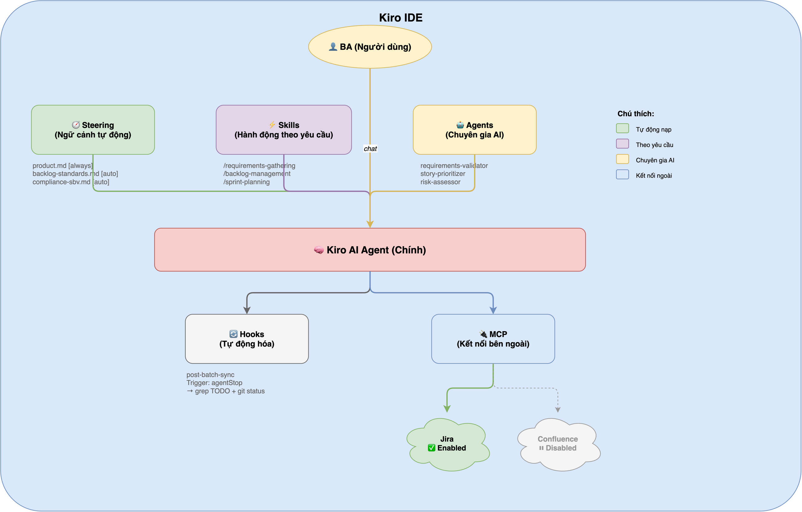
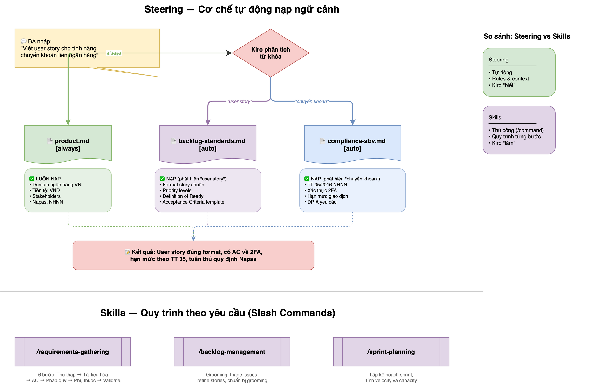
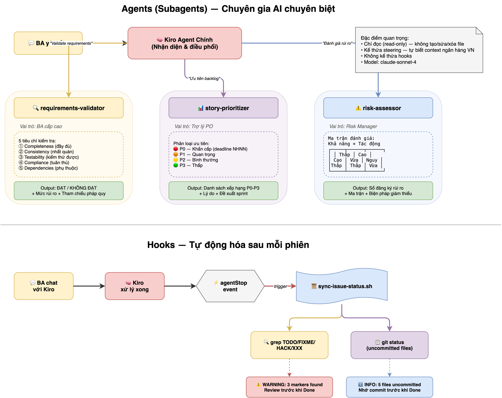
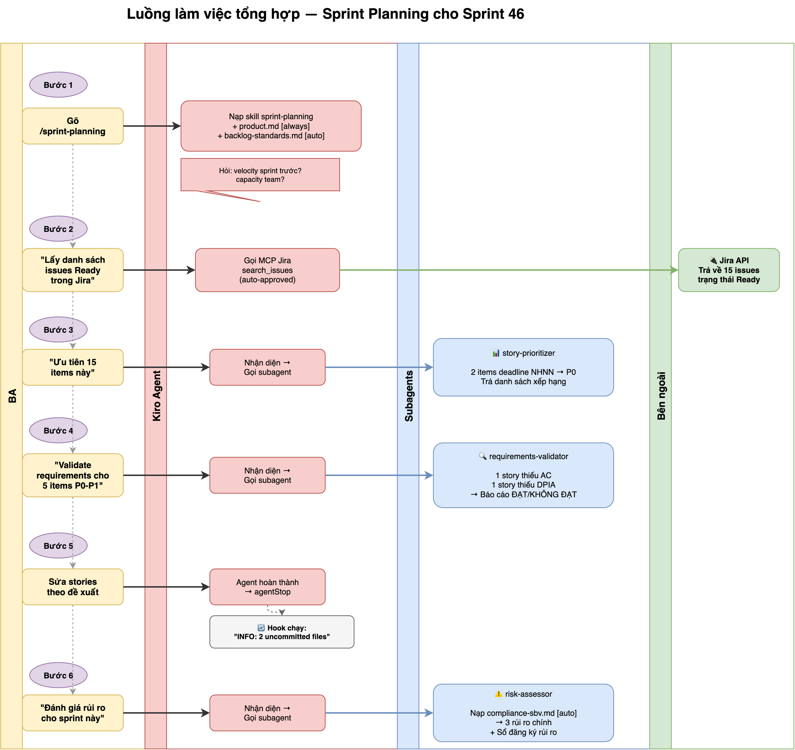

# Cơ chế hoạt động — BA Config cho Kiro IDE

Tài liệu này giải thích **cách từng thành phần trong `ba-config/` hoạt động** bên trong Kiro IDE, giúp BA hiểu rõ mình đang dùng gì và khi nào chúng kích hoạt.

---

## Tổng quan kiến trúc

Kiro IDE hoạt động dựa trên 5 thành phần chính (Five Elements). Bộ BA config này sử dụng 4 trong 5:



---

## 1. Steering — Ngữ cảnh tự động nạp

**Thư mục:** `.kiro/steering/`

Steering là các file markdown chứa **rules và context** được Kiro tự động đọc và áp dụng vào mọi cuộc hội thoại. Bạn không cần gọi chúng — chúng tự kích hoạt.

### Cơ chế kích hoạt

| File | Chế độ | Khi nào kích hoạt |
|------|--------|-------------------|
| `product.md` | `always` | **Luôn luôn** — mỗi khi bạn chat với Kiro, file này được nạp vào context. Kiro luôn biết bạn đang làm việc trong domain ngân hàng VN, dùng VND, có những stakeholders nào. |
| `backlog-standards.md` | `auto` | **Tự động khi topic khớp** — khi bạn nhắc đến "user story", "backlog", "sprint", "grooming", "refinement", Kiro nhận diện topic và tự nạp file này. |
| `compliance-sbv.md` | `auto` | **Tự động khi topic khớp** — khi bạn nhắc đến "tuân thủ", "NHNN", "compliance", "bảo mật", "dữ liệu cá nhân", Kiro tự nạp quy định NHNN. |

### Ví dụ thực tế



```
Bạn: "Viết user story cho tính năng chuyển khoản liên ngân hàng"

Kiro tự động nạp:
  ✅ product.md (always) → biết domain ngân hàng VN, VND, Napas
  ✅ backlog-standards.md (auto) → nhận diện "user story" → nạp format, priority, DoR
  ✅ compliance-sbv.md (auto) → nhận diện "chuyển khoản" liên quan pháp quy → nạp TT 35/2016

Kết quả: Kiro viết story đúng format, có acceptance criteria về 2FA,
         hạn mức theo TT 35, và tuân thủ quy định Napas.
```

### Tại sao chỉ 3 files?

Bộ full-team có 13 steering files (API standards, database, frontend, testing, deployment...). BA không cần những thứ đó — chúng chỉ thêm noise vào context và tốn token. 3 files này đủ để Kiro hiểu:
- **Bạn làm gì** (product.md)
- **Bạn viết story thế nào** (backlog-standards.md)
- **Quy định nào phải tuân thủ** (compliance-sbv.md)

---

## 2. Skills — Hành động theo yêu cầu

**Thư mục:** `.kiro/skills/`

Skills là các **quy trình có cấu trúc** mà bạn chủ động gọi bằng slash command (`/`). Khác với steering (tự động), skills chỉ kích hoạt khi bạn yêu cầu.

### Cơ chế hoạt động

```
Bạn gõ: /requirements-gathering

Kiro đọc: .kiro/skills/requirements-gathering/SKILL.md
        + .kiro/skills/requirements-gathering/references/story-examples.md

Kiro thực hiện quy trình 6 bước:
  1. Thu thập → hỏi bạn về nhu cầu nghiệp vụ
  2. Tài liệu hóa → viết story theo template
  3. Acceptance Criteria → tạo Cho trước/Khi/Thì
  4. Kiểm tra pháp quy → flag nếu liên quan NHNN/PDPA/PCI
  5. Phụ thuộc → liệt kê cross-service dependencies
  6. Validate → gọi requirements-validator agent kiểm tra
```

### 3 Skills có sẵn

| Slash Command | Mục đích | Khi nào dùng |
|---------------|----------|-------------|
| `/requirements-gathering` | Viết user stories từ đầu | Khi có yêu cầu nghiệp vụ mới cần tài liệu hóa |
| `/backlog-management` | Grooming và phân loại | Khi cần triage issues, refine stories, chuẩn bị grooming |
| `/sprint-planning` | Lập kế hoạch sprint | Khi planning session, cần tính velocity và capacity |

### Thư mục `references/`

Một số skills có thư mục `references/` chứa tài liệu bổ sung. Ví dụ `requirements-gathering` có `story-examples.md` — các ví dụ user story thực tế cho ngân hàng VN (xem số dư, chuyển khoản nội bộ, chuyển khoản Napas). Kiro đọc file này khi skill được gọi để tham khảo format và mức độ chi tiết.

### Skill vs Steering — Khác nhau thế nào?

| | Steering | Skill |
|---|---------|-------|
| Kích hoạt | Tự động (always/auto) | Thủ công (bạn gõ `/command`) |
| Nội dung | Rules, context, constraints | Quy trình từng bước, templates |
| Mục đích | Kiro "biết" context | Kiro "làm" theo quy trình |
| Ví dụ | "VND không có decimal" | "Viết user story theo 6 bước này" |

---

## 3. Agents (Subagents) — Chuyên gia AI chuyên biệt

**Thư mục:** `.kiro/agents/`

Agents là các **AI chuyên gia** với vai trò cụ thể. Chúng chạy độc lập với agent chính của Kiro, có system prompt riêng và chỉ có quyền đọc (không ghi file).

### Cơ chế hoạt động



```
Bạn: "Validate requirements trong file sprint-45-stories.md"

Kiro agent chính nhận lệnh
  → Nhận diện cần chuyên gia validate
  → Gọi subagent: requirements-validator
  → Subagent đọc file, áp dụng 5 tiêu chí kiểm tra
  → Trả kết quả về agent chính
  → Agent chính trình bày báo cáo cho bạn
```

### 3 Agents có sẵn

| Agent | Vai trò | Input | Output |
|-------|---------|-------|--------|
| `requirements-validator` | BA cấp cao — kiểm tra requirements | File requirements/stories | Báo cáo ĐẠT/KHÔNG ĐẠT + mức rủi ro + tham chiếu pháp quy |
| `story-prioritizer` | Trợ lý PO — ưu tiên backlog | Danh sách backlog items | Danh sách đã xếp hạng P0-P3 + lý do + đề xuất sprint |
| `risk-assessor` | Risk Manager — đánh giá rủi ro | Mô tả feature/sprint | Sổ đăng ký rủi ro với ma trận Khả năng × Tác động |

### Đặc điểm quan trọng

- **Chỉ đọc (read-only):** Agents không thể tạo/sửa/xóa file. Chúng chỉ phân tích và trả kết quả.
- **Không kế thừa hooks:** Hooks (như post-batch-sync) chỉ chạy ở agent chính, không chạy trong subagents.
- **Kế thừa steering:** Subagents tự động nhận steering files (product.md, backlog-standards.md...) — nên chúng cũng biết context ngân hàng VN.
- **Model riêng:** Mỗi agent có thể dùng model AI khác nhau. Hiện tại cả 3 đều dùng `claude-sonnet-4`.

### Cách gọi agent

Bạn không cần gõ lệnh đặc biệt. Chỉ cần mô tả yêu cầu, Kiro tự nhận diện agent phù hợp:

```
"Validate requirements trong file này"          → requirements-validator
"Ưu tiên 10 items backlog này cho sprint tới"   → story-prioritizer  
"Đánh giá rủi ro cho dự án eKYC"                → risk-assessor
```

---

## 4. Hooks — Tự động hóa sau mỗi phiên

**Thư mục:** `.kiro/hooks/`

Hooks là các **hành động tự động** được trigger bởi sự kiện trong IDE. Bộ BA config chỉ có 1 hook.

### Hook: Post-Batch Status Sync

```
Trigger: agentStop (mỗi khi Kiro agent hoàn thành 1 lượt xử lý)

Hành động: Chạy script sync-issue-status.sh

Script làm gì:
  1. Quét source code tìm TODO/FIXME/HACK/XXX
     → Nếu tìm thấy: cảnh báo "Found N markers, review trước khi Done"
  2. Kiểm tra git status
     → Nếu có uncommitted changes: nhắc "Nhớ commit trước khi Done"
```

### Luồng hoạt động

```
Bạn chat với Kiro → Kiro xử lý xong → agentStop event
                                            │
                                            ▼
                                   sync-issue-status.sh
                                            │
                                    ┌───────┴───────┐
                                    │               │
                              grep TODO/FIXME   git status
                                    │               │
                                    ▼               ▼
                              "WARNING: 3      "INFO: 5 files
                               markers found"   uncommitted"
```

### Tại sao chỉ 1 hook?

Bộ full-team có 10 hooks (chặn ghi file prod, quét credentials, guard SQL, kiểm tra coding standards...). BA không viết code nên không cần những hooks đó. Hook duy nhất giữ lại giúp BA nhớ kiểm tra trước khi đánh dấu issue là Done trên Jira.

---

## 5. MCP (Model Context Protocol) — Kết nối công cụ bên ngoài

**File:** `.kiro/settings/mcp.json`

MCP cho phép Kiro **gọi API của công cụ bên ngoài** trực tiếp từ chat.

### 2 MCP Servers cấu hình

| Server | Trạng thái | Kiro có thể làm gì |
|--------|-----------|---------------------|
| **Jira** | ✅ Enabled | Tìm issues, xem chi tiết issue, liệt kê sprints |
| **Confluence** | ⏸ Disabled (bật khi cần) | Tìm trang wiki, đọc nội dung trang |

### Cơ chế hoạt động

```
Bạn: "Tìm tất cả issues P0 trong sprint hiện tại"

Kiro nhận diện cần dữ liệu Jira
  → Gọi MCP server "jira"
  → MCP server chạy: npx @modelcontextprotocol/server-atlassian
  → Gửi request đến Jira API với token của bạn
  → Trả kết quả về Kiro
  → Kiro trình bày danh sách issues cho bạn
```

### Auto-Approve

Một số thao tác Jira được auto-approve (không hỏi bạn mỗi lần):
- `search_issues` — tìm kiếm issues
- `get_issue` — xem chi tiết 1 issue
- `list_sprints` — liệt kê sprints

Các thao tác khác (tạo issue, cập nhật status...) sẽ hỏi bạn xác nhận trước khi thực hiện.

### Cấu hình credentials

MCP dùng biến môi trường, không hardcode token:
```
${JIRA_API_TOKEN}  → Kiro đọc từ IDE settings
${JIRA_EMAIL}      → Email Atlassian của bạn
${JIRA_DOMAIN}     → Domain Jira (ví dụ: mybank.atlassian.net)
```

Bạn cấu hình 1 lần trong Kiro IDE settings → "Mcp Approved Env Vars".

---

## Luồng làm việc tổng hợp — Ví dụ thực tế

### Scenario: BA chuẩn bị sprint planning cho Sprint 46



```
Bước 1: Bạn gõ "/sprint-planning"
  → Kiro nạp skill sprint-planning
  → Kiro tự nạp steering: product.md (always) + backlog-standards.md (auto)
  → Kiro hỏi bạn về velocity sprint trước, capacity team

Bước 2: Bạn nói "Lấy danh sách issues Ready trong Jira"
  → Kiro gọi MCP Jira → search_issues (auto-approved)
  → Trả về 15 issues ở trạng thái Ready

Bước 3: Bạn nói "Ưu tiên 15 items này"
  → Kiro gọi subagent story-prioritizer
  → Subagent phân tích: 2 items liên quan deadline NHNN → P0
  → Trả về danh sách đã xếp hạng

Bước 4: Bạn nói "Validate requirements cho 5 items P0-P1"
  → Kiro gọi subagent requirements-validator
  → Subagent kiểm tra: 1 story thiếu acceptance criteria, 1 story thiếu DPIA
  → Trả về báo cáo ĐẠT/KHÔNG ĐẠT

Bước 5: Bạn sửa stories theo đề xuất
  → Kiro agent chính hoàn thành → agentStop
  → Hook post-batch-sync chạy → "INFO: 2 uncommitted files"

Bước 6: Bạn nói "Đánh giá rủi ro cho sprint này"
  → Kiro gọi subagent risk-assessor
  → Subagent tự nạp compliance-sbv.md (auto) vì liên quan deadline NHNN
  → Trả về sổ đăng ký rủi ro với 3 rủi ro chính
```

---

## Cấu trúc thư mục tóm tắt

```
ba-config/
├── AGENTS.md                              ← Rules bắt buộc (Kiro luôn đọc)
├── README.md                              ← Hướng dẫn cài đặt
├── HOW-IT-WORKS.md                        ← File này
└── .kiro/
    ├── steering/                          ← Context tự động
    │   ├── product.md                     [always] Bối cảnh nghiệp vụ
    │   ├── backlog-standards.md           [auto]   Format story, priority
    │   └── compliance-sbv.md              [auto]   Quy định NHNN
    ├── agents/                            ← Chuyên gia AI
    │   ├── requirements-validator.md      Validate requirements
    │   ├── story-prioritizer.md           Ưu tiên backlog
    │   └── risk-assessor.md               Đánh giá rủi ro
    ├── skills/                            ← Quy trình theo yêu cầu
    │   ├── requirements-gathering/
    │   │   ├── SKILL.md                   /requirements-gathering
    │   │   └── references/
    │   │       └── story-examples.md      Ví dụ story ngân hàng VN
    │   ├── backlog-management/
    │   │   └── SKILL.md                   /backlog-management
    │   └── sprint-planning/
    │       └── SKILL.md                   /sprint-planning
    ├── hooks/                             ← Tự động hóa
    │   ├── post-batch-sync.kiro.hook      Trigger: agentStop
    │   └── scripts/
    │       └── sync-issue-status.sh       Quét TODO + git status
    └── settings/
        └── mcp.json                       Jira + Confluence
```
